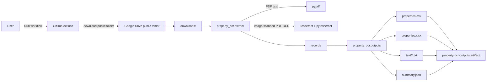
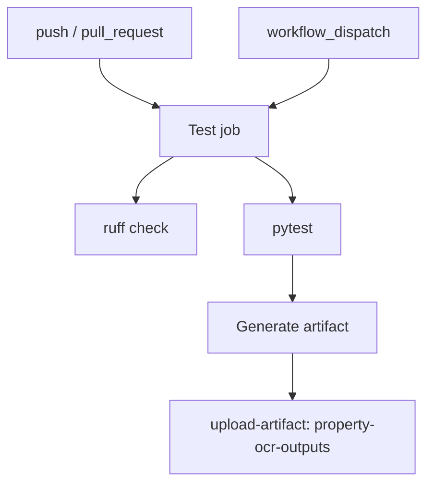

# Architecture

## 全体像

このrepoは、GitHub Actionsを実行環境として使うバッチ型OCRパイプラインです。ユーザーはGitHub Actionsの手動実行でGoogle Drive folder IDを指定し、完了後にartifactからCSV / Excel / TXTを取得します。



## 入力

- Google Drive folder ID
- またはローカル / repo内の `sample_data/`

初期値は以下です。

```text
11cA-CrY7rjlQlzdXywpT3i7PLRrXxOgD
```

## 処理フロー

1. `property-ocr` CLIを起動
2. `--drive-folder-id` があり `--no-download` でなければ、`gdown.download_folder()` で公開フォルダを取得
3. `SUPPORTED_EXTENSIONS` に該当するファイルを探索
4. PDFはまず `pypdf` でテキスト抽出
5. テキストが少ないPDFや画像はTesseract OCRを実行
6. 正規表現で不動産項目を抽出
7. CSV / Excel / TXT / JSON を生成
8. GitHub Actionsが `property-ocr-outputs` artifactとしてアップロード

## コンポーネント

| コンポーネント | 役割 |
|---|---|
| `cli.py` | 引数、実行制御、終了コード |
| `downloader.py` | 公開Google Drive folderの取得 |
| `extract.py` | OCR、PDFテキスト抽出、項目抽出 |
| `outputs.py` | CSV、Excel、TXT、JSON生成 |
| `.github/workflows/ocr.yml` | CI、手動OCR、artifact保存 |

## Secrets

初期版では必須Secretsはありません。

将来、private Google Driveに対応する場合は、repo secretsとして以下のようなSecret名を追加する想定です。実値はdocsやREADMEに書かないでください。

- `GOOGLE_SERVICE_ACCOUNT_JSON`
- `GOOGLE_DRIVE_FOLDER_ID`

## CI/CD



## 拡張案

- 固定フォーマット別の抽出ルール追加
- Google Drive private folder対応
- OCR前処理の強化
- 画像の傾き補正
- LLMによる項目抽出の後段追加
- 結果CSVのGitHub Pages公開
