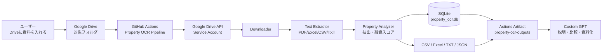
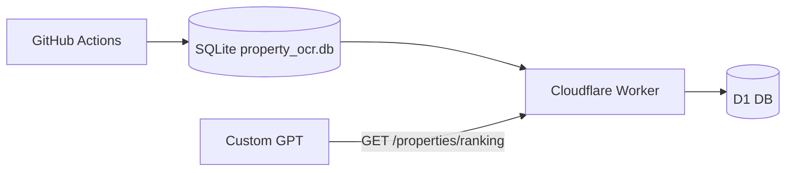

# アーキテクチャ

このリポジトリは、Google Driveに入れた物件資料をGitHub Actionsで定期処理し、Custom GPTが読みやすい成果物とSQL取得可能なDBに変換します。

## DB設計

SQLite DB `property_ocr.db` を毎回生成します。

| テーブル | 役割 |
|---|---|
| `properties` | 物件ごとの抽出・分析結果 |
| `drive_files` | 入力ファイル管理 |
| `analysis_runs` | 実行履歴 |

SQL例は **[database.md](database.md)** にまとめています。

## 将来拡張

SQLiteで安定したあと、Cloudflare D1へ同じスキーマを移すと、Custom GPT Actionsから読み取り専用APIで参照できます。

