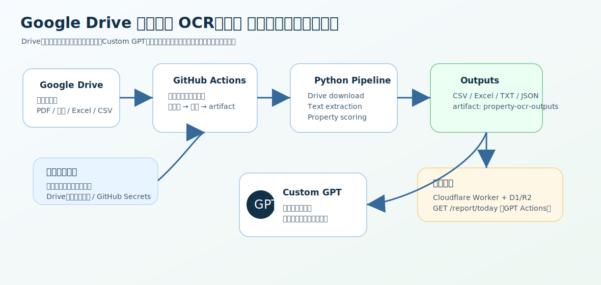
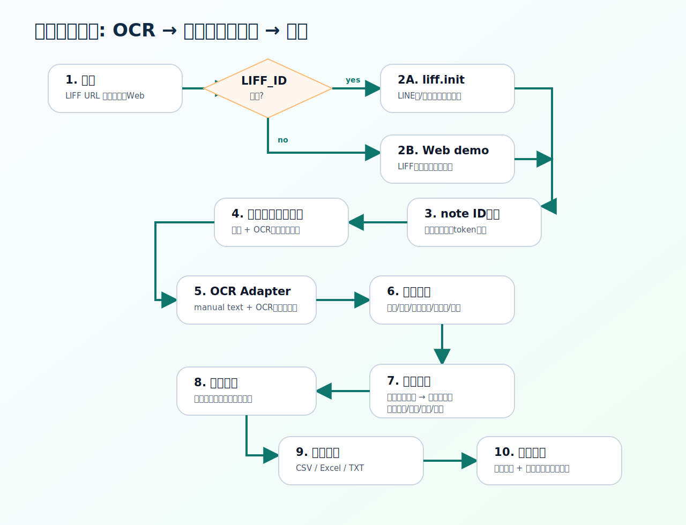

<h1>ワンさんツール Architecture</h1>
LINE LIFF風フロント、FastAPI、note ID認証、OCR入力、ボリューム判定、SQLite、CSV/Excel/TXT出力で構成します。

<h2>計算根拠の出し方</h2>
<code>analyze_text()</code> は結果だけでなく <code>calculation_basis.steps</code> を返します。各stepは <code>title</code>, <code>formula</code>, <code>substitution</code>, <code>result</code>, <code>comment</code> を持ち、画面・TXT・Excelに出力されます。
