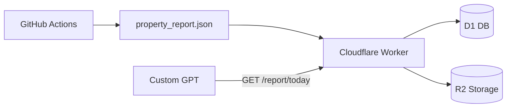

# アーキテクチャ

## 全体像

このリポジトリは、Google Driveに入れた物件資料をGitHub Actionsで定期処理し、Custom GPTが読みやすい成果物に変換します。

```mermaid
flowchart LR
    U[ユーザー\nDriveに資料を入れる] --> D[Google Drive\n対象フォルダ]
    D --> A[GitHub Actions\nProperty OCR Pipeline]
    A --> G[Google Drive API\nService Account]
    G --> X[Downloader]
    X --> T[Text Extractor\nPDF/Excel/CSV/TXT/Image]
    T --> P[Property Analyzer\n抽出・融資スコア]
    P --> O[Outputs\nCSV Excel TXT JSON]
    O --> R[Actions Artifact\nproperty-ocr-outputs]
    R --> C[Custom GPT\n説明・比較・資料化]
```

## 役割分担

| 部品 | 役割 |
|---|---|
| Google Drive | 物件概要書、PDF、画像、Excel、CSVの置き場 |
| GitHub Actions | 定期実行、テスト、成果物生成 |
| Google Drive API | サービスアカウントで対象フォルダだけ読む |
| Python Pipeline | ダウンロード、テキスト抽出、構造化、スコアリング |
| Actions Artifact | CSV / Excel / TXT / JSONの保管 |
| Custom GPT | 分析結果の説明、ランキング、銀行向け文章作成 |

## なぜCustom GPTがDriveを直接巡回しないのか

Custom GPT Actionsは、外部APIを呼ぶときにユーザー確認が出る場合があります。また、Google Driveの初回認証も避けられません。そのため、裏側のGitHub ActionsがDrive巡回と抽出を済ませ、Custom GPTは読み取り済みの結果だけを使う方が安定します。

## データフロー

1. ユーザーがDriveの対象フォルダに資料を入れる
2. GitHub Actionsが定期実行または手動実行される
3. サービスアカウントでDriveファイル一覧を取得する
4. 対象ファイルをダウンロードする
5. PDF、Excel、CSV、TXT、画像からテキストを抽出する
6. 価格、利回り、面積、所在地、構造、築年などを抽出する
7. 融資スコア、フルローン可能性、想定銀行、指値目安を作る
8. `property-ocr-outputs` artifactに保存する
9. Custom GPTが結果を読み、会話で整理・判断・資料化する

## 拡張方針

次の段階では、Cloudflare Worker + D1/R2を追加します。

この構成にすると、Custom GPT Actionsから `GET /report/today`、`GET /properties/ranking` のような読み取り専用APIを呼べます。OpenAPI Schemaでは `x-openai-isConsequential: false` を付けます。
