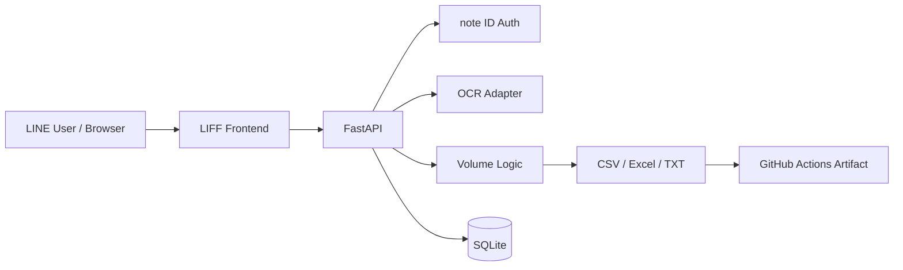
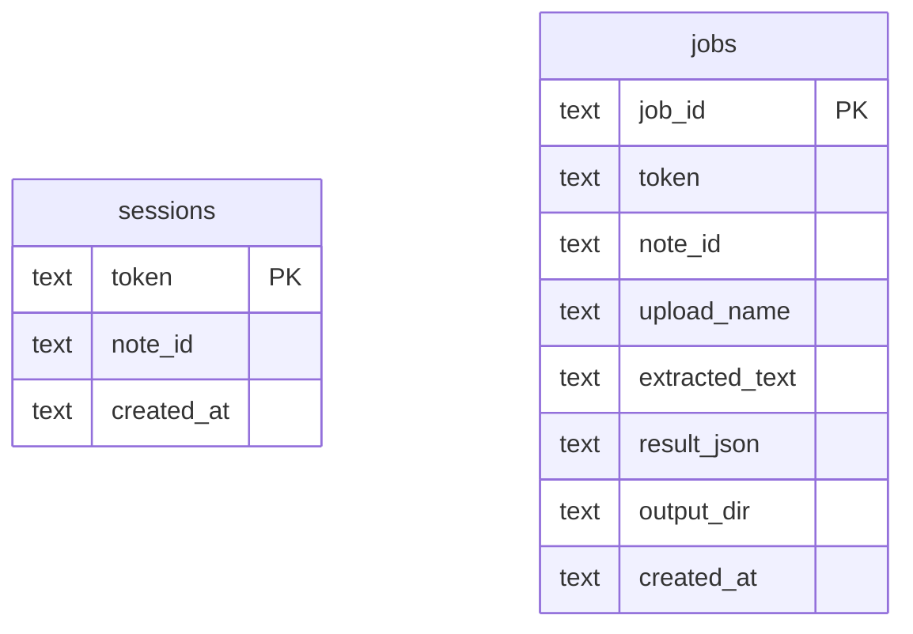

# Architecture

このリポジトリは、LINE LIFF風の不動産ボリューム検討チャットを独自実装したものです。

## 画像版

## 全体像

## フロントエンド

`app/static/` に静的HTML/CSS/JSを置いています。`LIFF_ID` が設定されている場合は、LIFF SDKの `liff.init()` を実行します。未設定の場合は通常Webアプリとして動きます。

## バックエンド

FastAPIで以下を提供します。

- `/api/session`: note IDを検証し、セッショントークンを発行
- `/api/analyze`: ファイル保存、OCR抽出、ボリューム判定、出力生成
- `/api/jobs/{job_id}`: 判定結果取得
- `/api/jobs/{job_id}/exports/{kind}`: CSV / Excel / TXTダウンロード

## DB

SQLiteにセッションとジョブ履歴を保存します。

## OCR

`app/services/ocr.py` がOCR境界です。デフォルトではCIで安定するfallback実装を使います。実運用ではこの層をGoogle Vision、Azure AI Vision、AWS Textract、pytesseractなどに差し替えます。

## ボリューム判定ロジック

`app/services/volume.py` が以下を抽出・計算します。

1. 土地面積
2. 用途地域
3. 建ぺい率
4. 容積率
5. 前面道路幅員
6. 道路幅員による容積率制限
7. 建築面積上限
8. 延床面積上限
9. 想定賃貸面積
10. 想定階数・戸数

## CI/CD

GitHub Actionsでlint、test、サンプル出力生成、artifact uploadを行います。

## Secrets

現時点で必須Secretはありません。実運用OCRやLINE Messaging APIなどを追加する場合は、以下のようなSecret名を使ってください。

- `LIFF_ID`
- `NOTE_ID_ALLOWLIST`
- `GOOGLE_APPLICATION_CREDENTIALS_JSON`
- `AZURE_VISION_ENDPOINT`
- `AZURE_VISION_KEY`
- `AWS_ACCESS_KEY_ID`
- `AWS_SECRET_ACCESS_KEY`

## 今後の拡張

- Cloud OCR実装
- note APIまたは会員DBとの連携
- Google Driveへの自動保存
- 物件別の履歴管理
- LINE Messaging APIによる結果通知
- PDF図面のページ別OCR
