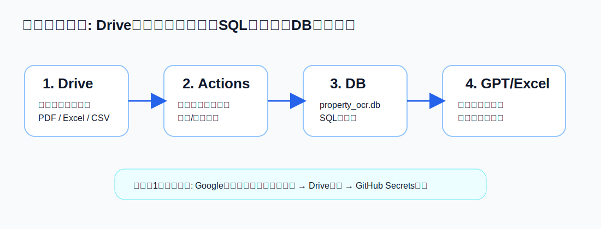
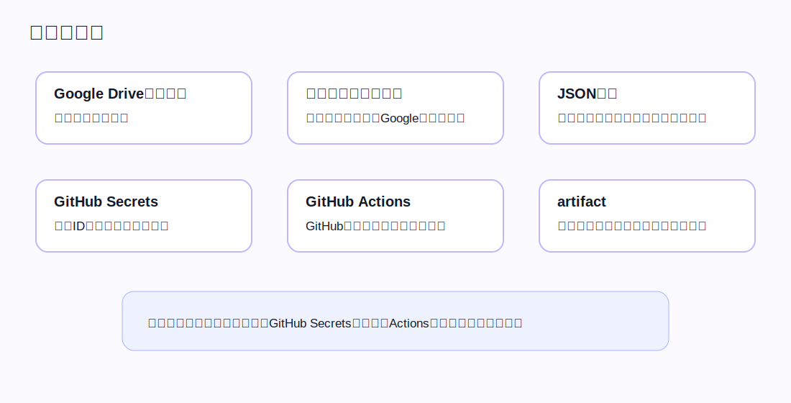
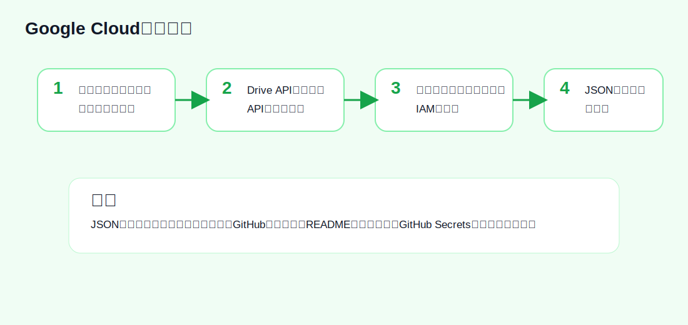
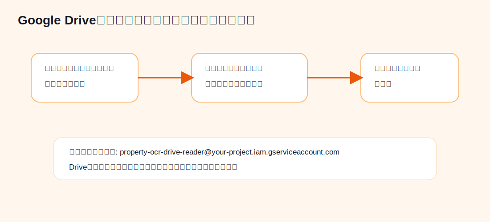
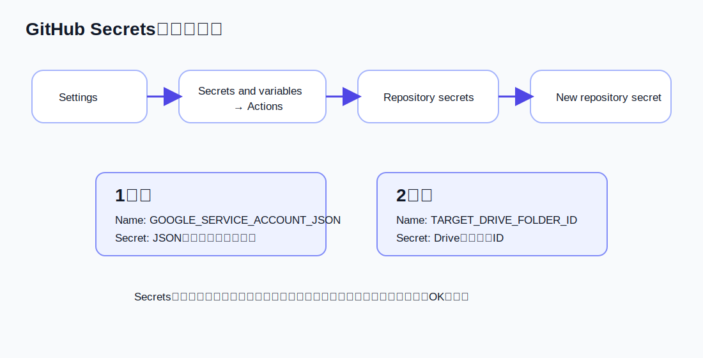
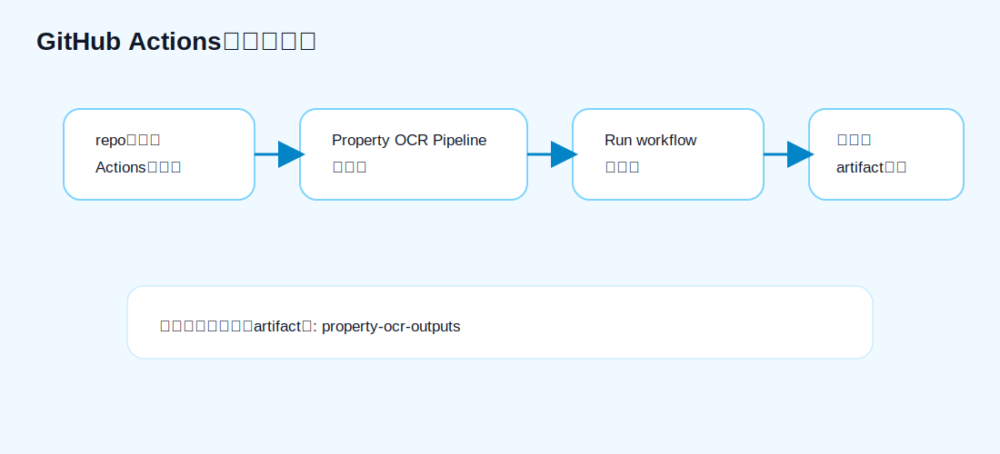
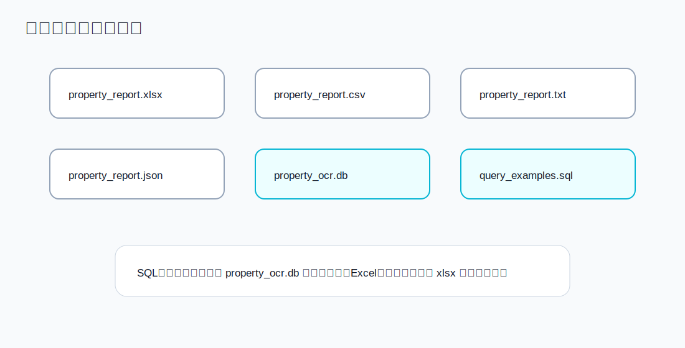

# 初心者向けセットアップ完全ガイド

このガイドは、Google Driveに物件資料を入れるだけで、GitHub Actionsが自動で分析し、CSV / Excel / TXT / JSON / SQLite DBを作るところまでの手順です。

## まず完成イメージ



やることは大きく4つです。

1. Google Cloudで「Driveを読む係」を作る
2. Google Driveフォルダをその係に共有する
3. GitHub Secretsに秘密情報を登録する
4. GitHub Actionsを実行して結果をダウンロードする

## 用語を先に整理



| 用語 | 意味 |
|---|---|
| Google Driveフォルダ | 物件概要書、PDF、Excel、CSVを入れる場所 |
| サービスアカウント | 人間ではなく、プログラム用のGoogleアカウント |
| JSONキー | サービスアカウントでログインするための鍵。絶対に公開しない |
| GitHub Secrets | JSONキーなどをGitHubに安全に保存する場所 |
| GitHub Actions | GitHub上で自動実行される処理 |
| artifact | 実行結果としてダウンロードできるファイル一式 |

## Step 1: Google CloudでDrive APIを有効化



1. Google Cloud Consoleを開く
2. プロジェクトを作成、または既存プロジェクトを選ぶ
3. 左上メニューから「APIとサービス」へ進む
4. 「ライブラリ」を開く
5. `Google Drive API` を検索
6. 「有効にする」を押す

## Step 2: サービスアカウントを作る

1. Google Cloud Consoleで「IAMと管理」→「サービスアカウント」へ進む
2. 「サービスアカウントを作成」を押す
3. 名前を入れる。例: `property-ocr-drive-reader`
4. 作成を進める
5. 作成したサービスアカウントをクリック
6. 「キー」タブを開く
7. 「鍵を追加」→「新しい鍵を作成」
8. `JSON` を選ぶ
9. ダウンロードされたJSONファイルを安全な場所に置く

このJSONファイルはパスワードと同じ扱いです。GitHubのコード、README、チャット、メールには貼らないでください。

## Step 3: サービスアカウントのメールを確認

JSONファイル、またはサービスアカウント画面に、次のようなメールがあります。

```text
property-ocr-drive-reader@your-project.iam.gserviceaccount.com
```

これを次のStepで使います。

## Step 4: Google Driveフォルダを共有する



1. Google Driveで対象フォルダを開く
2. フォルダを右クリック
3. 「共有」を押す
4. サービスアカウントのメールアドレスを入力する
5. 権限を「閲覧者」にする
6. 共有する

対象フォルダIDはURLの最後です。

```text
https://drive.google.com/drive/folders/11cA-CrY7rjlQlzdXywpT3i7PLRrXxOgD
```

この場合、フォルダIDはこれです。

```text
11cA-CrY7rjlQlzdXywpT3i7PLRrXxOgD
```

## Step 5: GitHub Secretsに登録する



GitHub repoで次の順番に進みます。

```text
Settings
→ Secrets and variables
→ Actions
→ Repository secrets
→ New repository secret
```

登録するSecretは2つです。

### 1つ目: GOOGLE_SERVICE_ACCOUNT_JSON

```text
Name:
GOOGLE_SERVICE_ACCOUNT_JSON

Secret:
Google CloudでダウンロードしたJSONファイルの中身を全部貼る
```

JSONファイル名ではなく、ファイルを開いた中身を貼ります。

### 2つ目: TARGET_DRIVE_FOLDER_ID

```text
Name:
TARGET_DRIVE_FOLDER_ID

Secret:
11cA-CrY7rjlQlzdXywpT3i7PLRrXxOgD
```

## Step 6: GitHub Actionsを実行する



1. repo上部の「Actions」を押す
2. 左側から「Property OCR Pipeline」を選ぶ
3. 「Run workflow」を押す
4. 実行が終わるまで待つ
5. 実行結果ページの下部から `property-ocr-outputs` をダウンロードする

## Step 7: ダウンロードできる成果物



| ファイル | 使い道 |
|---|---|
| `property_report.xlsx` | Excelで見る |
| `property_report.csv` | スプレッドシートやDB取込用 |
| `property_report.txt` | GPTに貼る・読む |
| `property_report.json` | API連携用 |
| `property_ocr.db` | SQLite DB。SQLで検索できる |
| `query_examples.sql` | よく使うSQL例 |

## SQLで取り出す例

```bash
python -m property_ocr_pipeline query \
  --db outputs/property_ocr.db \
  --sql "select property_name, price, gross_yield, loan_score from properties order by loan_score desc limit 10"
```

SQLiteアプリで `property_ocr.db` を開いて、次のSQLを実行してもOKです。

```sql
select
  property_name,
  address,
  price,
  gross_yield,
  loan_score,
  full_loan_possibility,
  recommended_banks
from properties
order by loan_score desc
limit 10;
```

## よくある失敗

### GitHub Actionsは成功したがサンプルしか出ない

GitHub Secretsが未設定です。`GOOGLE_SERVICE_ACCOUNT_JSON` と `TARGET_DRIVE_FOLDER_ID` を登録してください。

### Driveのファイルが0件になる

対象フォルダをサービスアカウントに共有できていない可能性が高いです。共有先メールが `...iam.gserviceaccount.com` になっているか確認してください。

### JSONエラーになる

`GOOGLE_SERVICE_ACCOUNT_JSON` にJSONファイル名ではなく、JSONの中身全文を貼ってください。

### 安全性が心配

最初はGitHub Actionsで動かすので、GitHub SecretsでOKです。将来Cloudflare Workerで常時API化する場合は、Cloudflare Secretsへ移します。さらに安全性を上げるなら、将来はGoogle Workload Identity Federation / OIDCに変更します。
